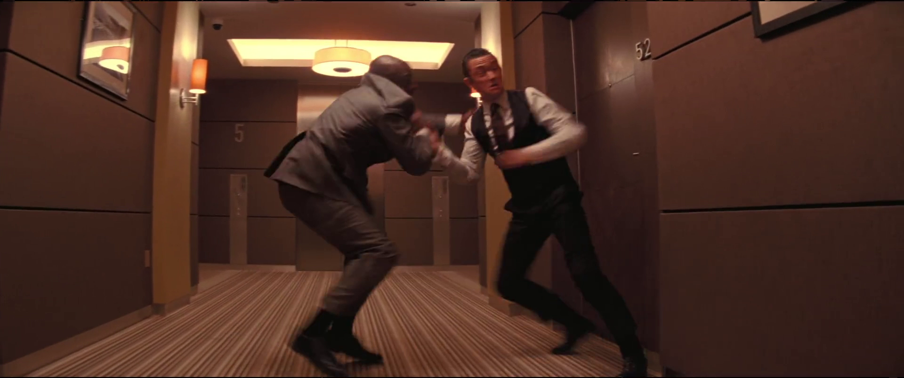
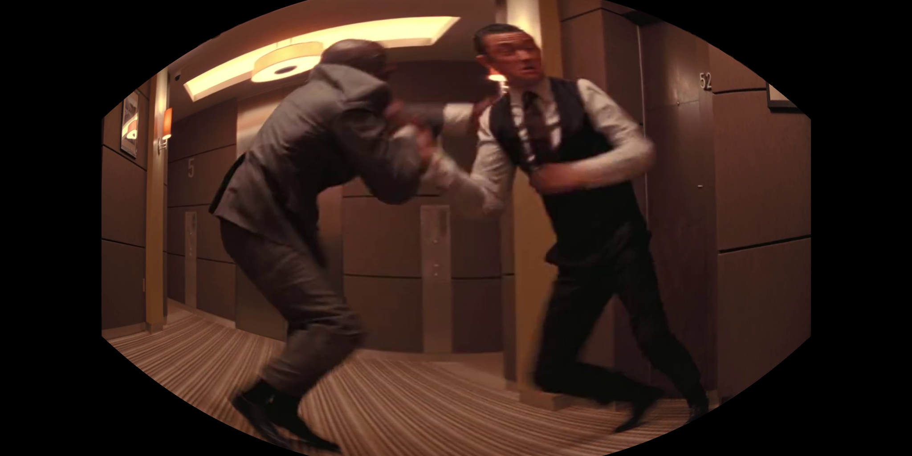
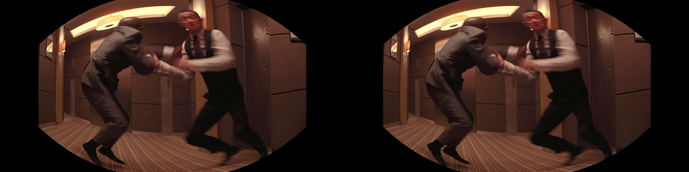

# VR 180 Degree (Monorepo)


## Project Overview
This project implements a VR 180-degree video processing pipeline that takes input video and processes it to create an immersive 180-degree VR experience. The following images demonstrate the processing pipeline:

### 1. Input Frame

*The original input frame from the video that will be processed for VR conversion.*

### 2. Depth Map Generation

*Depth estimation using MiDaS, showing the depth information of the scene.*

### 3. Left and Right Views
| Left View | Right View |
|-----------|------------|
|  |  |
*Stereo pair generated for the VR experience, showing the left and right eye views.*

### 4. Projected Views
| Left Projection | Right Projection |
|-----------------|------------------|
|  |  |
*The projected views after applying the VR transformation to each eye's perspective.*

### 5. Final Stitched Output
<div style="text-align: center;">
    
</div>
*The final stitched VR 180-degree output, ready for immersive viewing in VR headsets.*

## Tech Stack

### Backend
- **Framework**: FastAPI
- **Video Processing**: FFmpeg
- **3D Processing**: Open3D
- **Depth Estimation**: MiDaS
- **Image Processing**: OpenCV, NumPy
- **API Documentation**: Swagger UI (auto-generated)

### Frontend
- **Framework**: React
- **State Management**: React Hooks
- **Video Playback**: HLS.js
- **UI Components**: Material-UI
- **HTTP Client**: Axios

## Structure
- backend/ – FastAPI service, processing pipeline
- frontend/ – React app (HLS preview, final download)

## Prerequisites
- Python 3.10+
- FFmpeg in PATH
- Node 18+

## Backend Setup
```bash
cd backend
python -m venv .venv
# Windows PowerShell
. .venv\Scripts\Activate.ps1
pip install -r requirements.txt
uvicorn main:app --host 0.0.0.0 --port 8000 --reload
```

## Frontend Setup
```bash
cd frontend
npm install
# Windows PowerShell
$env:REACT_APP_BACKEND_URL="http://localhost:8000"
npm start
```

## Usage
1. Open frontend at http://localhost:3000
2. Choose VR180, select a video, click Process
3. Watch live preview via HLS (auto-refreshing)
4. When complete, either:
   - Download final MP4, or
   - Play final HLS at `/hls_final/final.m3u8`

## Notes
- Outputs and temporary data are ignored by git.
- For production, serve frontend behind a reverse proxy to backend `/hls` and `/hls_final`.
## VR_180

